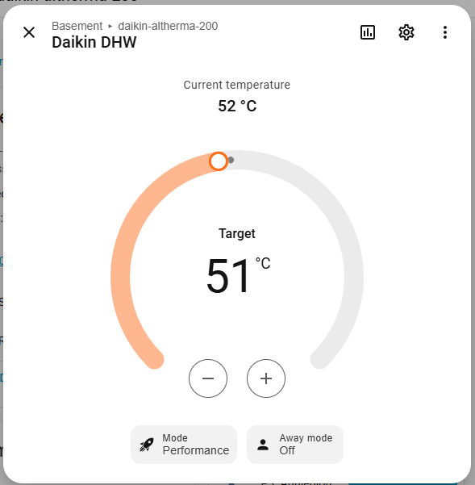

# ESPHome Daikin EKHHE

[](https://github.com/jcappaert/esphome-daikin-ekhhe/actions/workflows/ci.yml)
[](LICENSE)
[](https://esphome.io/components/external_components/)
[](https://esphome.io/)

ESPHome external component for Daikin EKHHE domestic hot water heat pumps, also known as Altherma M HW.

The component exposes known heat-pump readings, operating controls, installer parameters, target temperatures, recovery buttons, and an optional native Home Assistant water heater entity through ESPHome and Home Assistant.



## Status And Safety

This project is experimental and reverse engineered. It has been tested primarily with an `EKHHE260PCV37`.

Writes can change installer parameters on the heat pump. Incorrect settings, protocol bugs, bad wiring, or timing issues may misconfigure or damage your device. Use this component only if you are comfortable validating settings on the physical unit and recovering from a bad configuration.

This project is provided as-is; you use it at your own risk, and the maintainers are not responsible for damage to your equipment, property, or installation.

Recommended safety steps:

- Start from [`examples/minimal.yaml`](examples/minimal.yaml).
- Confirm read-only sensors are stable before enabling many writable entities.
- Save a known-good profile before making changes.
- Keep the original Daikin display connected and available for verification.
- Read [operations and recovery](docs/operations.md) before using restore buttons or broad parameter writes.

## Features

- Temperature and runtime sensors for the known EKHHE probe values.
- Optional native Home Assistant water heater entity for everyday DHW control.
- Binary status indicators for digital inputs, heat-pump activity, and electric-heater activity.
- Read-only indicators for confirmed display faults and alarms.
- Select entities for power state, operating mode, and known menu-style parameters.
- Number entities for known numeric installer parameters, target temperatures, and TX timing calibration.
- Persistent known-good and automatic recovery snapshots for managed settings.
- Restore-defaults button for documented default values in supported writable settings.
- Optional continuous receive mode for installations that need bus capture during normal polling.

## Hardware

You need an ESP32 with a UART connected through an RS485 transceiver to the display bus on connector `CN23`. The original display must remain connected.

Typical wiring uses:

- RS485 `A`, `B`, and `GND` tapped from `CN23`.
- ESP32 UART RX/TX connected to the RS485 transceiver.
- A suitable 5 V or 3.3 V power arrangement for your ESP32 board.

See [hardware](docs/hardware.md) for wiring notes and safety cautions.

## Quick Start

This component is tested with ESPHome `2026.5.3` or newer. Older ESPHome
versions may not include the native water heater command handling used by the
optional Home Assistant water heater entity.

Add this repository as an ESPHome external component:

```yaml
external_components:
  - source:
      type: git
      url: https://github.com/jcappaert/esphome-daikin-ekhhe
      ref: main
    components: [daikin_ekhhe]
```

Configure the UART and component:

```yaml
uart:
  rx_pin: GPIO20
  tx_pin: GPIO21
  baud_rate: 9600
  parity: NONE
  stop_bits: 1
  id: my_uart

daikin_ekhhe:
  - id: daikin_component
    update_interval: 10
```

Then add only the entities you want:

```yaml
water_heater:
  - platform: daikin_ekhhe
    ekhhe_id: daikin_component
    name: "Daikin DHW"

sensor:
  - platform: daikin_ekhhe
    low_water_temp_probe:
      name: "Lower water temperature"
    upper_water_temp_probe:
      name: "Upper water temperature"

select:
  - platform: daikin_ekhhe
    power_status:
      name: "Power status"
    operational_mode:
      name: "Operational mode"
```

The native water heater entity is the simplest Home Assistant UI for everyday use. The lower-level entities remain available when you want direct access to individual readings, parameters, recovery buttons, or diagnostics.

For complete starting points, use:

- [`examples/minimal.yaml`](examples/minimal.yaml): small everyday setup.
- [`examples/full.yaml`](examples/full.yaml): broader normal-user setup.

## Documentation

The links below are ordered as the recommended reading path for new users and contributors.

- [Hardware](docs/hardware.md): RS485 wiring, display-bus tap, and installation cautions.
- [Configuration](docs/configuration.md): YAML options, examples, entity groups, receive behavior, and TX timing.
- [Operations](docs/operations.md): writes, retries, profiles, restore defaults, and troubleshooting.
- [Protocol](docs/protocol.md): reverse-engineering notes for contributors.
- [Development](docs/development.md): local validation, CI fixtures, and contribution workflow.

## Credits

Protocol reverse engineering builds on earlier work by [lorbetzki/Daikin-EKHHE](https://github.com/lorbetzki/Daikin-EKHHE) plus live captures and testing from this project.
